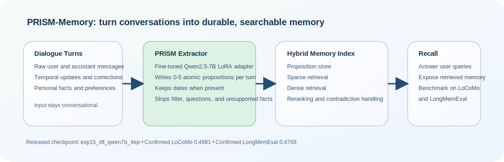

<div align="center">
  <h1>PRISM-Memory</h1>
  <p><strong>Turn conversations into durable, searchable memory.</strong></p>
  <p>PRISM-Memory is a 7B adapter that turns dialogue into compact, dated memory records for later retrieval.</p>
  <p>
    <a href="https://huggingface.co/AsadIsmail/prism-memory">
      
    </a>
    <a href="https://huggingface.co/spaces/AsadIsmail/prism-memory">
      
    </a>
    <a href="docs/release/README.md">
      
    </a>
  </p>
  <p>
    
  </p>
</div>

## Snapshot

- Released model: `PRISM-Memory 7B Adapter`
- Base model: `Qwen/Qwen2.5-7B-Instruct`
- Training data: `20,000` supervised extraction examples from a synthetic
  multi-session memory corpus

| Benchmark | PRISM-Memory | GPT-4.1-based PropMem reference | Read |
|---|---:|---:|---|
| LongMemEval | `0.4768` | `0.4650` | PRISM wins |
| LoCoMo | `0.4981` | `0.5360` | PRISM trails, but stays competitive |

This is an extractor-vs-extractor comparison with the QA layer held constant.

Useful entry points:
[Data](docs/release/datasets.md) ·
[End-To-End Scenarios](docs/release/memory-scenarios.md) ·
[Extraction Examples](docs/release/extraction-examples.md) ·
[Research Docs](docs/research/README.md)

## Why It Matters

Most chat systems treat memory as raw transcript search. PRISM-Memory writes
compact, inspectable memory records that later retrieval can use directly.

- It keeps hard constraints and preferences available for later workflows.
- It keeps current state separate from future plans.
- It supports dated recall instead of vague theme matching.
- It can refuse unsupported answers instead of inventing facts.

The short product-style walkthroughs live in
[docs/release/memory-scenarios.md](docs/release/memory-scenarios.md).

## Side-By-Side Extractions

These held-out examples come from the synthetic evaluation split and are
regenerated by
[scripts/release/generate_extraction_examples.py](scripts/release/generate_extraction_examples.py).
The structured artifact lives in
[results/extraction_examples.json](results/extraction_examples.json).

<details>
<summary><strong>Infrastructure bottlenecks stay structured</strong></summary>

**Turn**

> yeah, no real caching beyond basic Docker layer caching. Jenkins nodes have limited capacity, and we sometimes hit queue delays during peak commits.

**GPT-4.1 reference**

- No caching beyond basic Docker layer caching
- Jenkins nodes have limited capacity and experience queue delays during peak commits

**PRISM-Memory**

- No Docker caching beyond basic layer caching
- Jenkins nodes have limited capacity; peak commits cause queue delays

**Later question**

What is our current caching setup, and why do builds sometimes queue up?

**Answer from memory**

There is no special caching beyond basic Docker layer caching. Builds queue up
because Jenkins nodes have limited capacity during peak commits.

</details>

<details>
<summary><strong>Numeric constraints and preferences survive extraction</strong></summary>

**Turn**

> yeah, I think starting with incremental scans and parallel matrix jobs makes sense. We have 20 concurrent jobs max on GitHub Actions currently. Also want to keep Slack notifications from Snyk consistent with other pipeline alerts, aggregated and concise. Can you help draft the workflow?

**GPT-4.1 reference**

- GitHub Actions concurrency limit: 20 concurrent jobs
- Wants Snyk Slack notifications aggregated and concise, consistent with other pipeline alerts

**PRISM-Memory**

- GitHub Actions concurrency limit: 20 concurrent jobs
- Snyk Slack notifications should be aggregated and concise

**Later question**

What is our GitHub Actions concurrency limit, and how should Snyk alerts be
formatted?

**Answer from memory**

The limit is 20 concurrent jobs. Snyk Slack alerts should be aggregated and
concise.

</details>

<details>
<summary><strong>Current state and next-step plans stay grouped</strong></summary>

**Turn**

> yeah good point about resource overhead, we set CPU limits for all sidecars and monitor with Prometheus now. no mTLS yet, but it’s on the roadmap for phase two. as for routing, we want to start with canary deployments and traffic splitting, maybe some basic fault injection for testing.

**GPT-4.1 reference**

- Istio sidecar CPU limits set and monitored via Prometheus
- mTLS planned in phase two
- Plan to use canary deployments, traffic splitting, and basic fault injection

**PRISM-Memory**

- Sidecar CPU limits set and monitored via Prometheus
- Istio mTLS planned for phase two
- Routing strategy: canary deployments and traffic splitting; basic fault injection planned

**Later question**

Did we already enable mTLS, and what rollout strategy are we planning?

**Answer from memory**

mTLS is not enabled yet; it is planned for phase two. The rollout plan is
canary deployments and traffic splitting, with basic fault injection planned.

</details>

For benchmark-backed dated recall and refusal cases, see
[docs/release/memory-scenarios.md](docs/release/memory-scenarios.md).

## Training Data

The release is trained on synthetic data. No real user chat logs are part of
the public release story.

| Item | Count | Notes |
|---|---:|---|
| synthetic training conversations | `2,329` | multi-session conversations with inserts, updates, and deletes |
| synthetic held-out evaluation conversations | `584` | used to derive held-out extraction examples |
| supervised extraction examples | `100,427` | GPT-4.1-derived target memory records |
| training examples used for the released model | `20,000` | subset used for the public adapter |
| agent and task families | `6` | research, data analysis, QA, coding, planning, writing |

The full data write-up is in [docs/release/datasets.md](docs/release/datasets.md).
That page includes a concrete example training record, the corpus design, the
evaluation surfaces, and what is public today versus what is not yet published.

## What Is In This Repo

This repo has two surfaces.

| Surface | What it is for |
|---|---|
| Public PRISM release | one released model, one extraction skill, one Space demo, and the release docs |
| `frontier_memory` harness | the broader runtime and search package used to test memory behavior across synthetic tasks, TravelPlanner, ALFWorld, MemoryArena, and ongoing MemEval work |

If you only care about the released extractor, stay in
[docs/release/README.md](docs/release/README.md). If you want the broader
runtime and benchmark adapters, go to
[frontier_memory/README.md](frontier_memory/README.md) and
[docs/research/README.md](docs/research/README.md).

## Quickstart

Install the repo:

```bash
python -m pip install -e .
```

Run the demo:

```bash
make demo
```

Run the core test suite:

```bash
make test
```

Build a clean Space bundle:

```bash
make space-bundle
```

Build a clean model bundle:

```bash
make model-bundle
```

Run benchmark entrypoints:

```bash
python scripts/run_synthetic_eval.py --candidate candidates/bootstrap_v0.yaml --dataset-size 8 --seed 7
python scripts/run_travelplanner_eval.py --policy-file candidates/travelplanner_champion.yaml
python scripts/run_memeval_eval.py --benchmark locomo --num-samples 1 --skip-judge
```

The full command guide is in [scripts/README.md](scripts/README.md).

## Read Next

| If you want... | Start here |
|---|---|
| the release overview | [docs/release/README.md](docs/release/README.md) |
| the dataset design and example records | [docs/release/datasets.md](docs/release/datasets.md) |
| short end-to-end memory scenarios | [docs/release/memory-scenarios.md](docs/release/memory-scenarios.md) |
| held-out extraction comparisons | [docs/release/extraction-examples.md](docs/release/extraction-examples.md) |
| the extraction contract | [docs/release/extraction-skill.md](docs/release/extraction-skill.md) |
| the confirmed release numbers | [docs/release/release-results.md](docs/release/release-results.md) |
| the technical write-up of what worked and what failed | [docs/release/technical-blog.md](docs/release/technical-blog.md) |
| the broader runtime and adapters | [frontier_memory/README.md](frontier_memory/README.md) |
| setup and benchmark commands | [scripts/README.md](scripts/README.md) |

## Project Layout

| Path | Purpose |
|---|---|
| `assets/` | repo visuals |
| `docs/` | release docs and research docs |
| `examples/` | toy dialogue, extraction, and recall examples |
| `frontier_memory/` | runtime package, search logic, and benchmark adapters |
| `space/` | Gradio demo and Hugging Face Space bundle |
| `results/` | tracked JSON artifacts used by the public docs |
| `scripts/` | setup, release helpers, and benchmark runners |
| `candidates/` | YAML policies and promoted champions |
| `contract/` | scoring and search contracts |
| `logs/` | research notes and experiment history |
| `external/` | optional local benchmark checkouts, not part of the public payload |
| `tests/` | regression tests and committed fixtures |

## Broader Research Harness

The repo also contains the broader `frontier_memory` runtime used for ongoing
memory research beyond this one release. That work stays in the repo, but the
top-level landing page keeps the public identity focused on the released PRISM
extractor. If you want the broader search and benchmark story, start in
[docs/research/README.md](docs/research/README.md).
